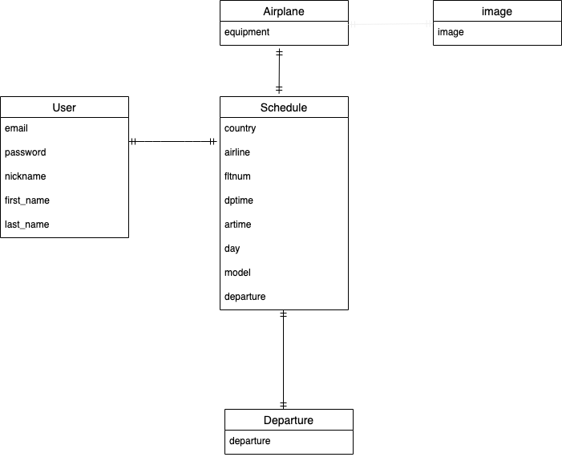

# Flight-Search

## 概要
 flight-searchとは、日本発のフライトを航空会社問わずに表示できるサイトです。
 フライトを調べる際に各航空会社のサイトへと直接閲覧しなければならなかった作業が、
 このサイトにて検索することによってすぐに検索することができます。

## URL
https://flight-search-30473.herokuapp.com/

## テスト用アカウント

Basis認証
ID : flight
pass : 1111

## 利用方法

1. サイトに新規登録を行います。(既に登録済みのユーザーはログイン)

1. 複数の検索タグから条件を指定していただき、検索ボタンをクリックします。

1. クリック後、便名・航空会社名・フライト時間が表示されます。

1. トップページから"航空会社一覧"へと遷移する事で、各航空会社のサイト一覧画面をみることができます。
   一覧画面の各航空会社のロゴ・名前をクリックすることで各航空会社サイトへと遷移することができます。

## 目指した課題解決
本アプリケーションで改善できることは、物流のオペレーションデスクで働いている従業員の業務時間短縮をすることです。
問い合わせ毎に航空会社のスケジュールが記載されている冊子を開き、該当のページを探す業務を無くすことができます。
また、各航空会社のサイトを検索やブックマークをして都度開くという作業が、本アプリケーションを使用することにより効率化されます。

## 要件定義


| トップページ                                                                       |
| ---------------------------------------------------------------------------------- | 
| 【ボタン】                                                                         | 
| ・ヘッダーに新規登録/ログインできるボタンがある。                                  | 
| ・(ログイン後)ユーザーネーム/ログアウトできるボタンがある。                        | 
| ・複数の検索条件がプルダウン方式で表示されている。                                 | 
| ・複数条件を設定後に検索結果画面へと遷移できるボタンがある。                       | 
| ・条件は出発地・到着地・機種・曜日で検索できる様にする。                           | 
| ・航空会社一覧画面へと遷移することができるボタンがある。                           | 
| ・ログインしていないユーザーが検索ボタンをクリックするとログインページに遷移する。 | 


| 検索結果画面                                                         |
| -------------------------------------------------------------------- | 
| 【表示】                                                             | 
| ・ヘッダー/フッターはトップページと共通の表示にする。                | 
| ・検索結果一覧を表示させる。                                         | 
| ・検索結果は、白抜きにして表示される様にする。                       | 
| 【ボタン】                                                           | 
| ・トップページに戻ることができるボタンがある。                       | 
| ・ヘッダーのアイコンをクリックするとトップページに戻ることができる。 | 
| ・航空会社一覧画面へと遷移することができるボタンがある。             |


| 航空会社一覧画面                                                     |
| -------------------------------------------------------------------- | 
| 【表示】                                                             | 
| ・航空会社ロゴの一覧を3つずつ横並びに表示する。                      | 
| ・航空会社名をロゴの下に表示する                                     | 
| ・ロゴと航空会社名をクリックすると各航空会社のHPへと遷移する。       | 
| 【ボタン】                                                           | 
| ・トップページへと戻るボタンがある。                                 | 
| ・ヘッダーのアイコンをクリックするとトップページに戻ることができる。 | 


## 各機能の説明

### 新規登録/ログイン機能
トップページヘッダー右のボタンより、新規登録/ログイン機能の実装を行いました。
新規登録をする際には、emailアドレス・password及び姓と名を記述して登録を行う様に実装をしました。


ログインをする場合には、emailアドレス及びpasswordの入力を行う様に実装を行いました。


### 複数検索機能
Gem"Ransack"を使用して、各テーブルに保存した値からカラム事に複数条件を検索する実装を行いました。
検索の指定方法はプルダウンにて条件を指定して検索を行います。


ログインせずに検索ボタンをクリックした場合は、ログイン画面へと遷移する様に設定しています。


### 航空会社一覧
航空会社の一覧画面の実装を行いました。
機能としては、ロゴと航空会社の名前を横並びにて表示を行い、クリックをすると航空会社のHPへと遷移する様に指定しました。


## 今後実装予定の機能

1. 検索結果画面の航空会社名をクリックすると詳細画面を表示する機能
⇨各航空機の機材とコメント投稿機能を追加してリアルタイムで情報を共有できる様に実装を行う。

1. 新規登録を行う際にGoogle及びFaceBookの情報を使用して新規登録ができる機能

1. 航空運賃と燃油サーチャージの計算機能
⇨詳細画面にて航空運賃と燃油サーチャージが計算できる様に実装を行う。

## データーベース設計



### Departure テーブル

| Column          | Type   | Options     |
| --------------- | ------ | ----------- |
| departure       | string | null: false |

#### Association

- has_many :schedules

### Schedule テーブル

| Column          | Type    | Options            |
| --------------- | ------- | ------------------ |
| country         | string  | null: false        |
| airline         | string  | null: false        |
| fltnum          | integer | null: false        |
| dptime          | time    | null: false        |
| artime          | time    | null: false        |
| day             | string  | null: false        |
| model           | string  | null: false        |
| departure       |         | foreign_key: true  |


#### Association
- belongs_to :user
- belongs_to :departure

users テーブル

| Column          | Type   | Options     |
| --------------- | ------ | ----------- |
| email           | string | null: false |
| password        | string | null: false |
| nickname        | string | null: false |
| first_name      | string | null: false |
| last_name       | string | null: false |

#### Association

- has_many :schedules

## ローカルでの動作方法

```
$ heroku git:clone -a flight-search-30473
$ cd flight-search-30473
```
